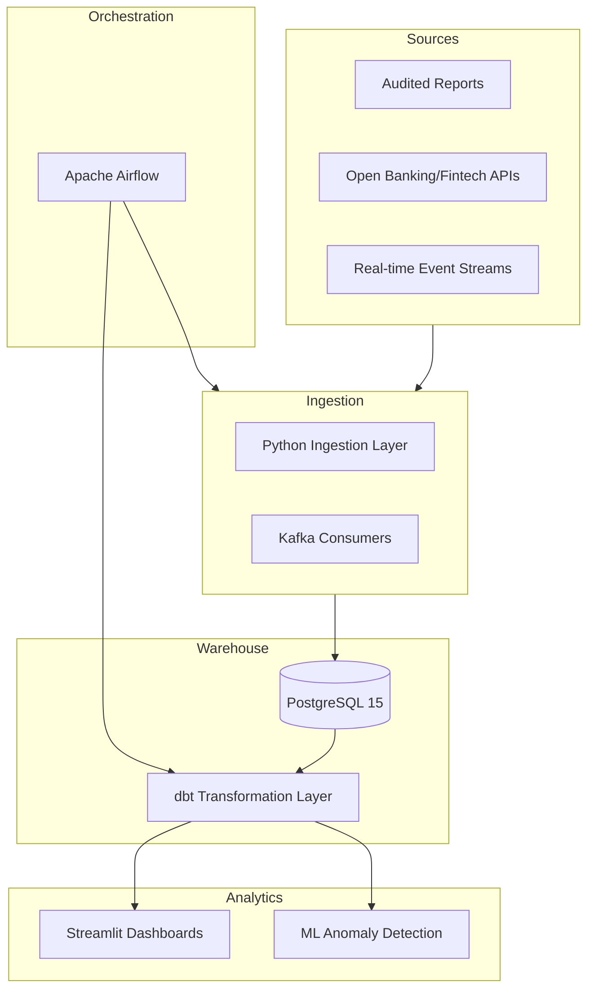

# 🏗️ Portfolio Architecture

This portfolio is built on a modular, distributed data engineering architecture designed for high availability, reproducibility, and scalability.

## High-Level Data Flow

## Modular Stack
Each project in this portfolio is containerized using **Docker Compose**, allowing for independent deployment of the specific stack required (e.g., Kafka for streaming projects, pdfplumber for report parsing).

## Transformation Layers (dbt)
We follow the standard dbt modeling convention across all projects:
1. **Staging**: Light cleaning and casting of raw source data.
2. **Intermediate**: Complex business logic, feature engineering, and currency normalization.
3. **Marts**: Denormalized tables optimized for BI visualization and ML training.

## CI/CD and Quality
- **GitHub Actions**: Automated SQL linting and model compilation.
- **dbt Tests**: Built-in data quality validation (uniqueness, null checks, range constraints).
- **Pytest**: Unit testing for Python transformation and ingestion logic.
