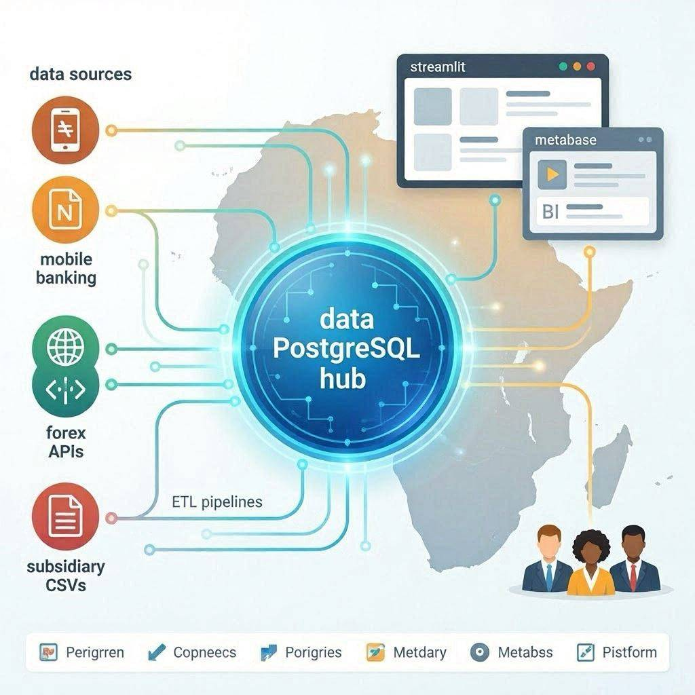

# 🏦 Equity Group Integrated Data Platform



This directory contains the integrated data engineering pipelines for Equity Group, covering multi-national financial consolidation and mobile banking (Equitel/EazzyPay) analytics.

## 🚀 Overview

The platform provides a unified view of Equity Group's Pan-African operations. It handles complex multi-currency normalization across 7 subsidiaries and models adoption curves for its MVNO and digital payment platforms, all managed via a shared infrastructure.

## 🛠️ Integrated Projects

| Project Name | Tech Stack | Description |
| :--- | :--- | :--- |
| [Equity Kenya Transaction Analytics](./Equity_Kenya_Transaction_Analytics) | `Python`, `dbt`, `PostgreSQL`, `Plotly` | Deep-dive into Equity Bank Kenya's transaction mix, county distribution, and channel efficiency. |
| [Equitel & EazzyPay Analytics](./Equitel_EazzyPay_Analytics) | `Python`, `dbt`, `PostgreSQL`, `Airflow`, `Matplotlib` | Analysis of mobile banking adoption, transaction velocity, and ARPU trends. |
| [Pan-Africa Financial Platform](./Pan_Africa_Financial_Platform) | `Python`, `dbt`, `PostgreSQL`, `Airflow`, `Forex Logic` | Multi-subsidiary financial consolidation with automated currency normalization to USD and KES. |

## 🏗️ Unified Infrastructure

The projects share a common containerized environment managed at this root level:

- **Shared Database**: PostgreSQL instance with dual-database initialization (`equitel_analytics` and `pan_africa_platform`).
- **Unified Orchestrator**: A single Apache Airflow instance managing DAGs for both regional consolidation and mobile analytics.
- **BI & Visualization**: Integrated Metabase for dashboarding and embedded Matplotlib visuals in executed notebooks.

## 📊 Integrated Analytics Dashboard

The platform includes a detailed multi-tab Streamlit dashboard providing insights into regional performance and digital banking adoption.

### Key Features:
- **🌍 Regional Performance**: Tracking of Assets, Profit, and Digital Adoption across 7 markets (Kenya, DRC, Rwanda, Uganda, etc.).
- **🇰🇪 Equity Kenya Transactions**: Deep-dive into local transaction mix by channel (EazzyPay, Equitel, ATM) and geographic distribution by County.
- **📱 Digital & Equitel Analytics**: Modeling of EazzyPay/Equitel user growth curves and Revenue per User (ARPU).
- **📊 Market Comparison**: Efficiency analysis using interactive scatter-bubble charts (Assets vs. Profitability).

### Accessing the Dashboards:
1. **Interactive Dashboard (Streamlit)**: 
   - **Live Demo**: [🚀 View Equity Integrated Dashboard](https://kipruto45-victor-kipruto-rop-portfolio-g8pspygfpttsbfggjaadwy.streamlit.app/)
   - **Local URL**: [http://localhost:8502](http://localhost:8502)
   - **Command**: `streamlit run dashboard_app.py` from the project root.
2. **BI Layer (Metabase)**:
   - **URL**: [http://localhost:3001](http://localhost:3001)
3. **Master Hub**: Accessible via the [Master Dashboard](../master_dashboard.py).

## 🚦 Getting Started

### 1. Launch Services
Use the unified Makefile to start the platform:
```bash
make up
```

### 2. Run Pipelines
Execute end-to-end data flows for both projects:
```bash
# Equitel Analytics
make dbt-run-equitel

# Pan-Africa Platform
make dbt-run-pan-africa
```

## 🚀 Project Goals
The platform provides a unified view of Equity Group's Pan-African operations, handling complex multi-currency normalization across 7 subsidiaries and modeling digital adoption.

---
*Maintained by the Data Engineering Team*


## Data Sources

This project utilizes the following data sources:
- `Equity_Kenya_Transaction_Analytics/dashboards/snapshots/mart_kenya_channel_performance.csv`
- `Equity_Kenya_Transaction_Analytics/dashboards/snapshots/mart_kenya_county_activity.csv`
- `Equity_Kenya_Transaction_Analytics/dashboards/snapshots/mart_kenya_transaction_trends.csv`
- `Equity_Kenya_Transaction_Analytics/ingestion/equity_kenya_transactions_raw.csv`
- `Equitel_EazzyPay_Analytics/ingestion/eazzypay_transactions.csv`
- `Equitel_EazzyPay_Analytics/ingestion/equitel_subscribers.csv`
- `Pan_Africa_Financial_Platform/dbt/seeds/customer_master.csv`
- `Pan_Africa_Financial_Platform/dbt/seeds/subsidiaries.csv`
- `Pan_Africa_Financial_Platform/dbt/target/run/pan_africa_platform/seeds/customer_master.csv`
- `Pan_Africa_Financial_Platform/dbt/target/run/pan_africa_platform/seeds/subsidiaries.csv`
- `Pan_Africa_Financial_Platform/ingestion/equity_subsidiary_performance.csv`
- `Pan_Africa_Financial_Platform/ingestion/subsidiary_financials.csv`
- `dashboards/snapshots/mart_adoption_curve.csv`
- `dashboards/snapshots/mart_arpu_benchmark.csv`
- `dashboards/snapshots/mart_cross_sell_rate.csv`
- `dashboards/snapshots/mart_group_consolidation.csv`
- `dashboards/snapshots/mart_product_mix.csv`
- `dashboards/snapshots/mart_regional_engagement.csv`
- `dashboards/snapshots/mart_subsidiary_comparison.csv`
- `dashboards/snapshots/mart_subsidiary_performance.csv`
