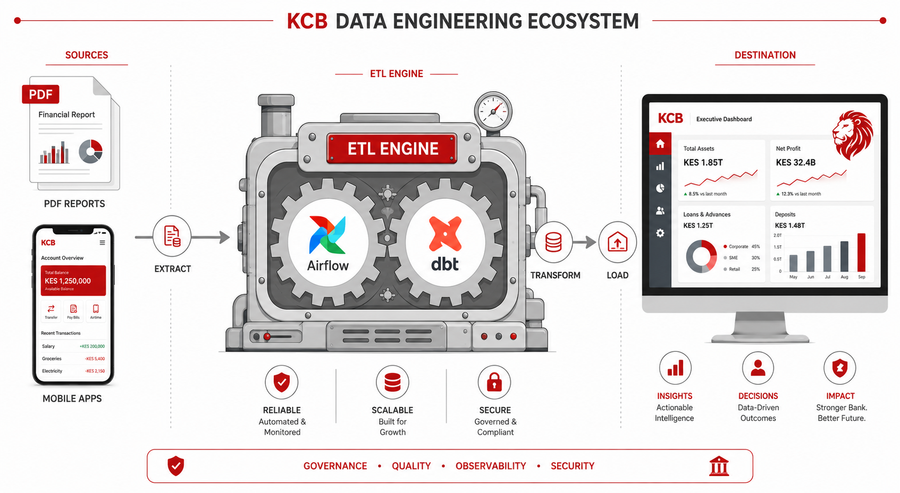

# 🦁 KCB Group Integrated ETL & Analytics Platform



### 🚀 Live Dashboard
**[View Live Analytics Dashboard](https://kipruto45-victor-kipruto-rop-portfolio-3y88yox8geeqdsvzbqnmzg.streamlit.app)**

---

## Overview
A comprehensive data engineering platform designed to ingest, transform, and visualize KCB Group's financial performance and mobile lending (M-Pesa) analytics. The system integrates real-world audited financial statements with advanced credit risk modeling.

### Key Components
1.  **Financial Performance Tracker**: Regional subsidiary tracking (Kenya, Uganda, Tanzania, etc.) with automated ingestion of FY 2025 audited financials via PDF parsing.
2.  **M-Pesa Loan Book Analytics**: Mobile credit cohort analysis, vintage performance tracking, and repayment velocity modeling.
3.  **Integrated Dashboard**: A secure Streamlit interface providing deep-dive insights into profitability, asset quality (NPL), and credit risk.

## Tech Stack
*   **Orchestration**: Apache Airflow
*   **Transformation**: dbt (Data Build Tool)
*   **Database**: PostgreSQL
*   **Visualization**: Streamlit & Plotly
*   **Ingestion**: Python (pdfplumber, Pandas)
*   **Containerization**: Docker & Docker Compose

## Features
*   **Real Data Ingestion**: Custom PDF extractor for KCB Group PLC audited disclosures.
*   **KPI Marts**: Automated calculation of NIM (Net Interest Margin), ROE (Return on Equity), and ROA.
*   **Vintage Analysis**: Heatmaps and default evolution curves for M-Pesa loan cohorts.
*   **Portable Design**: Built-in CSV fallback mechanism for seamless cloud deployment.
*   **Security**: Authentication layer for data protection.

## Usage
1.  **Local Execution**:
    ```bash
    cd KCB_Group(ETL)
    docker compose up -d
    ```
2.  **Access Points**:
    *   Dashboard: `http://localhost:8503`
    *   Airflow: `http://localhost:8083`

---
*Created by Victor Kipruto - Data Engineering Portfolio*
