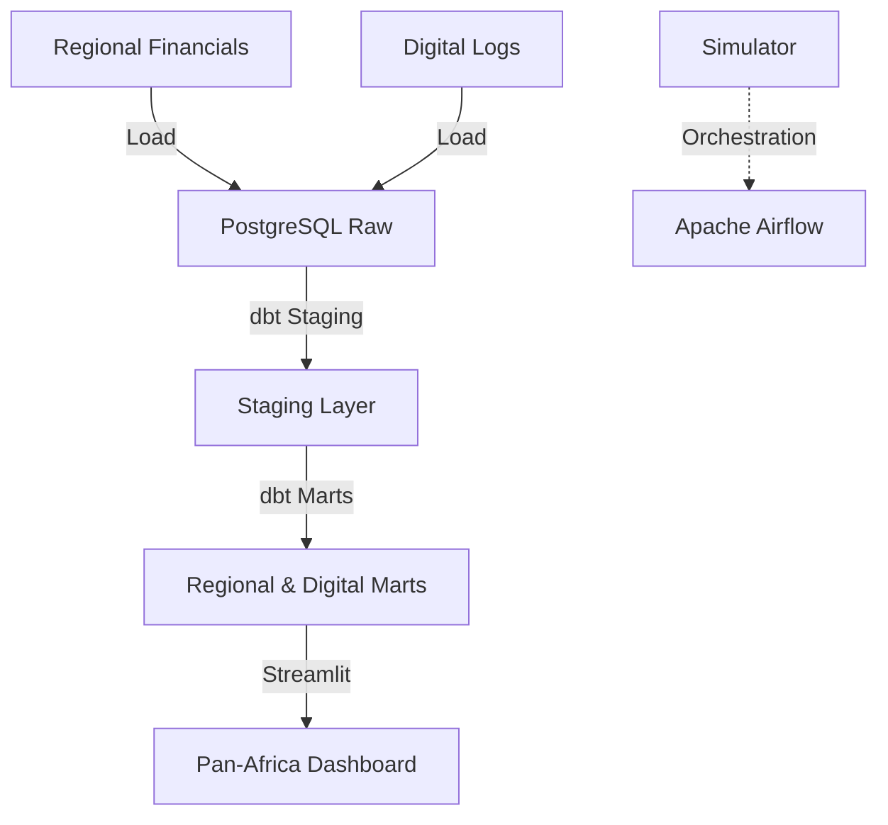

# 🏦 Equity Group Pan-Africa ETL Platform

## Overview
This project manages the multi-subsidiary ETL and analytical workflows for Equity Group. It consolidates financial performance across 7 regional markets, tracks digital adoption on Equitel and EazzyPay, and provides deep-dive transaction analytics for the Kenyan market.

## Architecture


## Data Sources
- **Subsidiary Financials**: Audited regional results with currency normalization (USD/KES).
- **Digital Adoption**: Subscriber growth and transaction velocity for Equitel and EazzyPay.
- **Kenya Transactions**: Simulated high-fidelity transaction logs for the Kenyan ecosystem.

## Tech Stack
- **Orchestration**: Apache Airflow
- **Transformation**: dbt Core (PostgreSQL)
- **Database**: PostgreSQL 15
- **Visualization**: Streamlit, Plotly
- **Environment**: Docker, Docker Compose

## Folder Structure
```text
equity_group_etl/
├── dags/               # Multi-subsidiary ETL DAGs
├── dbt/                # Consolidated dbt project
├── ingestion/          # Cross-market ingestion scripts
├── dashboards/         # Visualization layer
├── tests/              # Data quality tests
├── docker-compose.yml  # Local stack definition
└── README.md
```

## How to Run
1. **Launch Stack**:
   ```bash
   docker-compose up -d
   ```
2. **Execute dbt**:
   ```bash
   cd dbt
   dbt run
   dbt test
   ```
3. **Access Dashboard**: Open `http://localhost:8502`

## Key Metrics / Outputs
- **Group Consolidation**: USD/KES profit contribution by regional market.
- **Market Matrix**: Digital maturity vs. Profitability benchmarking.
- **Adoption Curves**: S-curve modeling for Equitel user acquisition.
