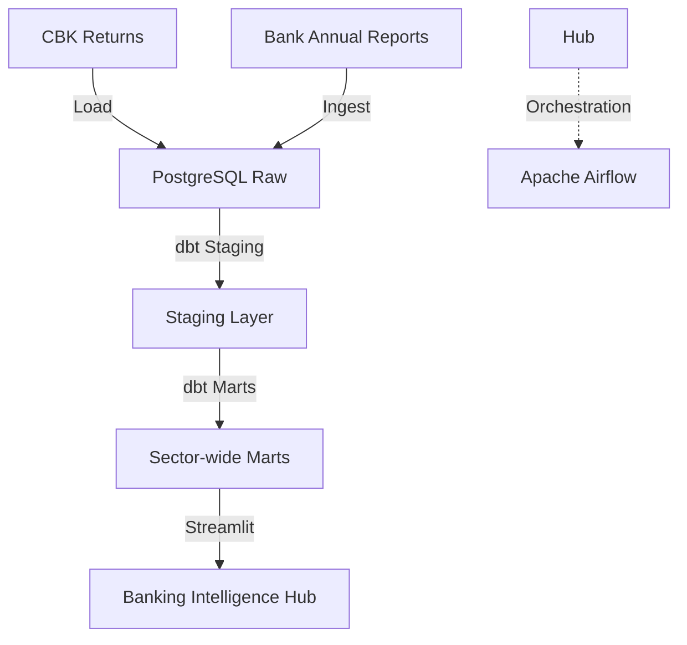

# 🏦 Kenya Banking Sector Integrated Analytics

## Overview
This platform provides sector-wide analytical insights into the Kenyan banking ecosystem. It consolidates Central Bank of Kenya (CBK) supervision returns, mortgage market data, and interbank lending rates to provide a comprehensive view of macro-financial stability and peer performance.

## Architecture


## Data Sources
- **CBK Supervision Reports**: Aggregate sector metrics (NPL, Liquidity, Capital).
- **Mortgage Market Surveys**: Yearly residential mortgage data.
- **Interbank Rates**: Daily lending rate logs from the money market.

## Tech Stack
- **Orchestration**: Apache Airflow
- **Transformation**: dbt Core (PostgreSQL)
- **Database**: PostgreSQL 15
- **Visualization**: Streamlit, Plotly
- **Environment**: Docker, Docker Compose

## Folder Structure
```text
kenya_banking_sector/
├── dags/               # Sector-wide ETL DAGs
├── dbt/                # Consolidated dbt project
├── ingestion/          # CBK and macro-data scrapers
├── dashboards/         # Visualization layer
├── tests/              # dbt and python tests
├── docker-compose.yml  # Local stack definition
└── README.md
```

## How to Run
1. **Launch Stack**:
   ```bash
   docker-compose up -d
   ```
2. **Execute dbt**:
   ```bash
   cd dbt
   dbt run
   dbt test
   ```
3. **Access Dashboard**: Open `http://localhost:8504`

## Key Metrics / Outputs
- **NIM & NPL Benchmarking**: Comparison across all 38+ licensed banks.
- **Capital Adequacy Trends**: Sector-wide resilience monitoring.
- **Interbank Liquidity**: Market-wide lending rate volatility.
