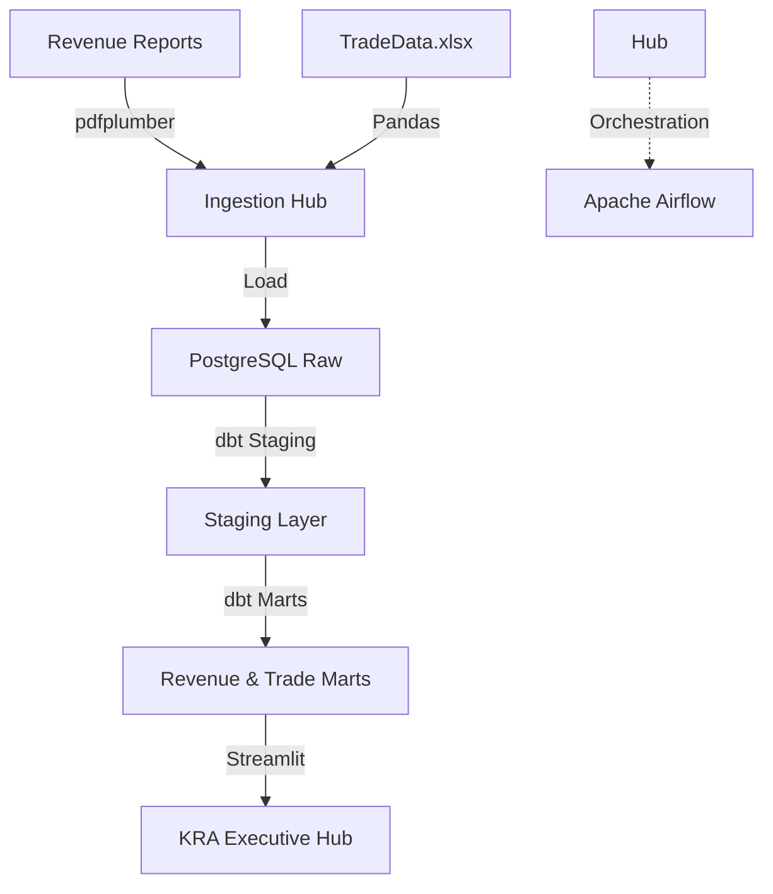

# 🇰🇪 KRA National Revenue & Trade Platform

## Overview
This platform manages the automated ingestion and analysis of Kenya's national tax revenue, customs trade balances, and macro-economic indicators. It transforms data from PDF reports and structured files into actionable fiscal intelligence.

## Architecture


## Data Sources
- **KRA Revenue Reports**: FY 2021-2025 audited performance.
- **Customs & Trade**: Integrated trade statistics and Rules of Origin disclosures.
- **Economic Surveys**: National GDP and industry growth rates (2026 Survey).

## Tech Stack
- **Orchestration**: Apache Airflow
- **Transformation**: dbt Core (PostgreSQL)
- **Database**: PostgreSQL 15
- **Visualization**: Streamlit, Plotly
- **Environment**: Docker, Docker Compose

## Folder Structure
```text
kra_data_engineering/
├── dags/               # Fiscal & Trade ETL DAGs
├── dbt/                # Consolidated dbt project
├── ingestion/          # PDF parsing & Excel loading
├── dashboards/         # Visualization layer
├── tests/              # Data quality tests
├── docker-compose.yml  # Local stack definition
└── README.md
```

## How to Run
1. **Launch Stack**:
   ```bash
   docker-compose up -d
   ```
2. **Execute dbt**:
   ```bash
   cd dbt
   dbt run
   dbt test
   ```
3. **Access Dashboard**: Open `http://localhost:8506`

## Key Metrics / Outputs
- **YoY Revenue Growth**: Performance by primary tax heads.
- **Trade Balance**: Import/Export volume by HS-code commodity.
- **Tax-to-GDP Ratio**: National tax efficiency modeling.
