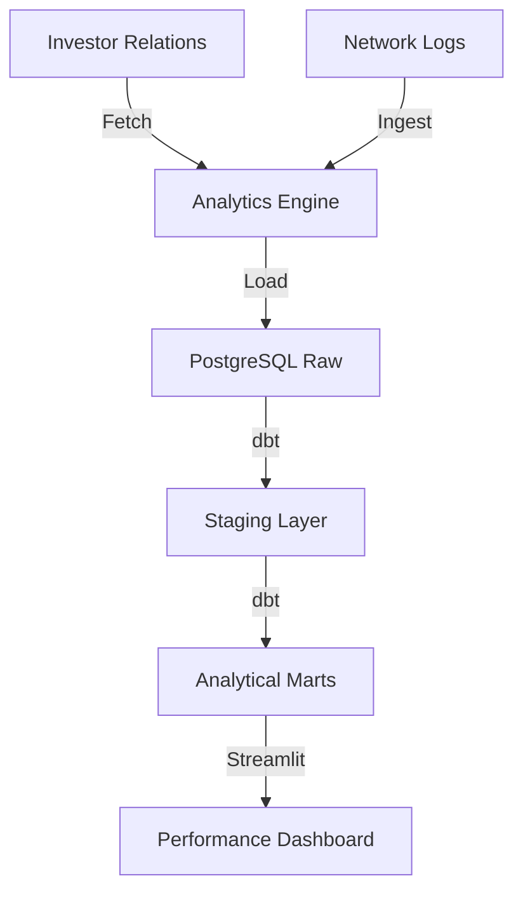

# 📱 Safaricom Integrated Analytics Engine

## Overview
This platform provides a high-fidelity 360-degree view of Safaricom PLC's operational and financial ecosystem. It integrates audited financial results, mobile credit risk modeling (Fuliza), loyalty program analytics (Bonga), and regional network quality tracking.

## Architecture


## Data Sources
- **Financial Results**: Audited Safaricom Group results (FY 2021-2025).
- **Fuliza Metrics**: Simulated high-fidelity cohort data aligned with GSMA benchmarks.
- **Network Quality**: Regional availability and speed logs based on CA Kenya standards.

## Tech Stack
- **Ingestion**: Python (Analytics Engine)
- **Transformation**: dbt Core (PostgreSQL)
- **Database**: PostgreSQL 15
- **Orchestration**: Apache Airflow
- **Visualization**: Streamlit, Plotly

## Folder Structure
```text
safaricom_pipeline/
├── dags/               # Operation & Financial DAGs
├── dbt/                # Transformation layer
├── ingestion/          # Core analytics engine
├── dashboards/         # Visualization layer
├── tests/              # dbt and python tests
├── docker-compose.yml  # Local stack definition
└── README.md
```

## How to Run
1. **Launch Stack**:
   ```bash
   docker-compose up -d
   ```
2. **Execute Ingestion**:
   ```bash
   python ingestion/safaricom_analytics_engine.py
   ```
3. **Run dbt**:
   ```bash
   cd dbt
   dbt run
   ```
4. **Access Dashboard**: Open `http://localhost:8513`

## Key Metrics / Outputs
- **Revenue Mix**: Analysis of M-Pesa, Voice, and Data contributions.
- **Credit Portfolio Quality**: Fuliza NPL and repayment velocity tracking.
- **Network QoS**: Regional availability and speed benchmarking.
